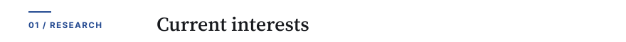
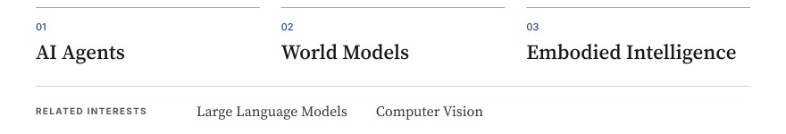
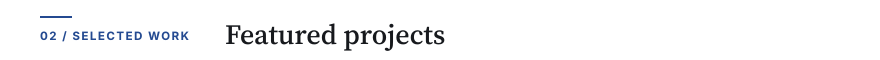
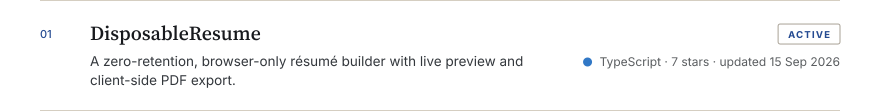
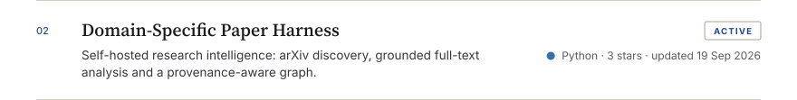
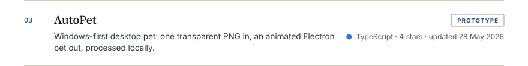
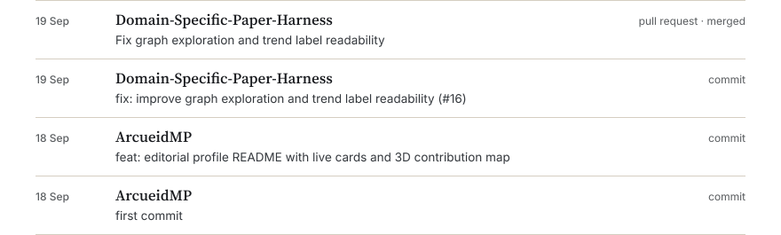
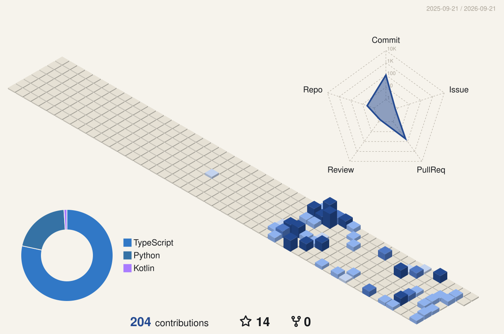

<picture>
<source media="(prefers-color-scheme: dark)" srcset="assets/hero-dark.svg">

</picture>

I build software around AI agents and research tooling: a self-hosted paper-discovery pipeline, a browser-only résumé builder, and a small desktop-pet prototype. I am looking for undergraduate research opportunities in agents, world models, and embodied intelligence.

<picture>
<source media="(prefers-color-scheme: dark)" srcset="assets/label-research-dark.svg">

</picture>

<picture>
<source media="(prefers-color-scheme: dark)" srcset="assets/interests-dark.svg">

</picture>

<picture>
<source media="(prefers-color-scheme: dark)" srcset="assets/label-work-dark.svg">

</picture>

<a href="https://github.com/ArcueidMP/DisposableResume"><picture>
<source media="(prefers-color-scheme: dark)" srcset="assets/project-1-dark.svg">

</picture></a>
<a href="https://github.com/ArcueidMP/Domain-Specific-Paper-Harness"><picture>
<source media="(prefers-color-scheme: dark)" srcset="assets/project-2-dark.svg">

</picture></a>
<a href="https://github.com/ArcueidMP/AutoPet"><picture>
<source media="(prefers-color-scheme: dark)" srcset="assets/project-3-dark.svg">

</picture></a>

<picture>
<source media="(prefers-color-scheme: dark)" srcset="assets/label-log-dark.svg">

</picture>

<picture>
<source media="(prefers-color-scheme: dark)" srcset="assets/log-dark.svg">

</picture>

<picture>
<source media="(prefers-color-scheme: dark)" srcset="assets/label-activity-dark.svg">

</picture>

<picture>
<source media="(prefers-color-scheme: dark)" srcset="profile-3d-contrib/profile-dark.svg">

</picture>

 

Set in Source Serif 4 and Inter. The cards are vectors generated from <a href="profile.toml">profile.toml</a> by <a href="scripts/build.py">scripts/build.py</a>; the contribution map is drawn by <a href="https://github.com/yoshi389111/github-profile-3d-contrib">github-profile-3d-contrib</a>. Everything refreshes daily through GitHub Actions and shows public data only.
